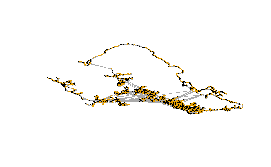
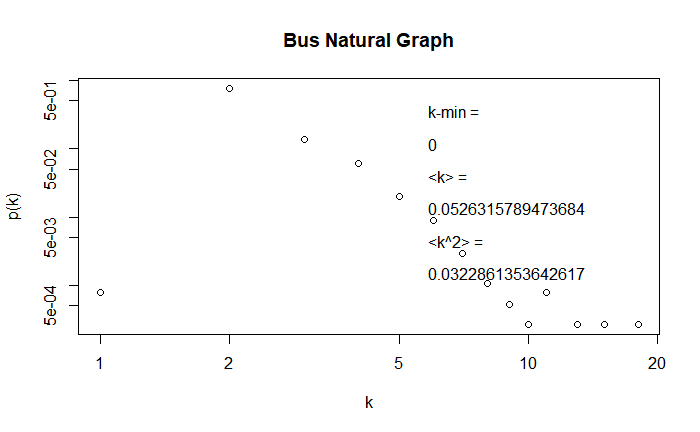
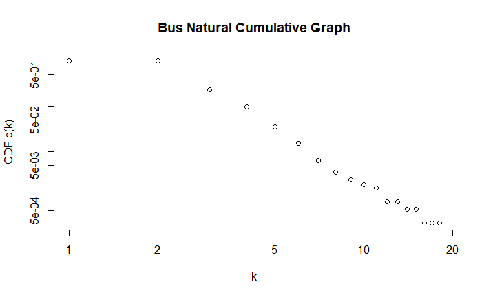
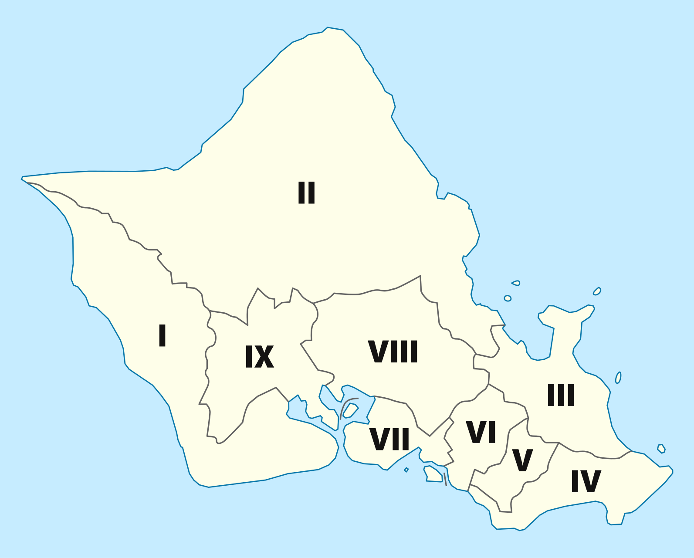
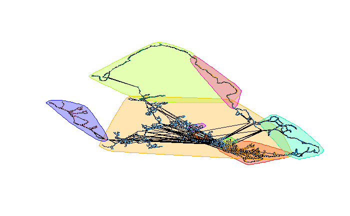
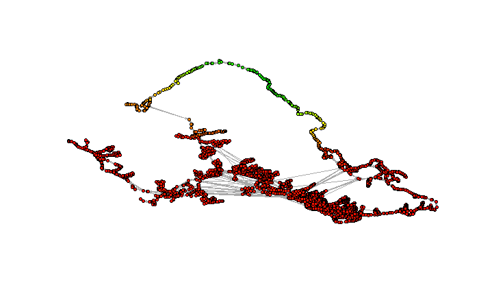

# Using Network Analysis to Research the Oahu Bus Network
## Motivation
The Downs---Thompson paradox states the following: the equilibrium speed of car traffic on a road network is determined by the average door-to-door speed of equivalent journeys taken by public transport. In other words, the speed of all traffic on a road is controlled by the speed of the public transportation along that road. It is a paradox because worsening the road for private driver to improve public transportation will create more motivation to use public transportation, improving private transportation as well. This motivates research improving bus transportation in high traffic areas, such as that of Honolulu, Hawai'i. Honolulu ranks 18th worst city in the United States for the annual global traffic scorecard for 2023 by INRIX.

City bus networks are comprised of a set amount of bus stops and bus routes carrying passengers between the bus stops according to a fixed time schedule. This schedule is publicly available for almost every city bus system, with Honolulu as no exception. Therefore, Honolulu is a valid choice to perform a network analysis on.

One may perform a network analysis on a bus network by setting bus stops as vertices and bus routes connecting bus stops as edges. This creates a directed graph with multiple edges between vertices. With this structure, one may then perform a mathematical analysis of the graph and its structure.

## Method
Our work revolves around the public General Transit Feed Specification (GTFS) schedule provided by the Oahu Transportation Service. This information details bus stops by an identification number, longitude, latitude, and a street name label---this derives the vertices for a bus network. The information also details bus routes connecting the stop identification numbers, with a corresponding bus route identification number and a time table---this derives the edges for the bus network.

We created a code that allows one to convert a GTFS directory into two comma separated values files (.csv), a vertices list and edge list. These files may then be imported into a graph visualization program, such as that of Gephi, a free open source software. From here, a proper graph file may be exported (.graphml), then imported into iGraph on R. From here, calculations are done strictly in R.

This process creates a multi-edge directed network. For now, we are more interested in the topology of the network and not specific times or scheduling; we may simplify the network, collapsing parallel edges and removing self-loops. We then create edge weights based on the physical distance calculated by longitude and latitude.

```
  IGRAPH 09b4308 D-W- 3755 4496 --
  + attr: label (v/c), r (v/n), g (v/n), b (v/n), x
  | (v/n), y (v/n), size (v/n), latitude (v/n),
  | longitude (v/n), id (v/c), weight (e/n)
```
<figure markdown="span">
  { width="500" }
  <figcaption>Initial plot of data as a graph arranged by longitude and latitude before cleaning.</figcaption>
</figure>

This network may be plotted, using a layout determined by the longitude and latitude of the vertices. This creates a geographic layout of the bus stops. with edges directly connecting between them.

From here, standard network analysis metrics may be computed, such as that of the vertex count, edge count, mean degree, and rankings by degree. This allows up to highlight important bus stops relevant to the graph.

Comparison to similar random generated network models will explain the important properties of the natural bus network. This allows us to determine that some properties of the bus network are not inherit from the properties used to generate the random graphs.

A degree distribution and power-law fit is necessary, as transportation systems often use the word hub to describe transit centers. Therefore, one may expect to see the network follow a power law.

Centrality metrics may be compared. These centrality metrics measure importance of vertices in different ways. Therefore, we may determine the importance of bus stops through these different metrics.

The Leiden community detection algorithm will be applied to the network to determine the communities as seen through the lens of the urban transit system. Analysis of communities through the lens of transit systems is an effective way of loosely partitioning a state. Society functions through movement; the movement of people can be recognized as the routes of public transportation, so community detection of bus transit networks describes districts in terms of movement.

## Vertices Results
### Hub Structure
| Top 10 Degrees                      |
| ----------------------------------- |
| VINEYARD BL + PALAMA ST	            |
| VINEYARD BL + PALAMA ST	            |
| KALIHI TRANSIT CENTER	              |
| S KING ST + PUNCHBOWL ST	          |
| KAMEHAMEHA HWY + OPP SALT LAKE BL		|
| WAIANAE TRANSIT CENTER		          |
| HALAWA ALOHA STADIUM STATION		    |
| HICKAM AFB MAIN GATE		            |
| MEHEULA PKWY + KUAHELANI AVE		    |
| S BERETANIA ST + OPP KALAKAUA AVE	  |

| Vertices Count = $N$ | Edge Count = $M$ | Mean Degree = $\langle k \rangle$ | $\ln N$ | $\ln N / \ln \langle k \rangle$ | $\ln \ln N$ |
| -------------------- | ---------------- | --------------------------------- | ------- | ------------------------------- | ----------- |
| 3755                 | 4496             | 2.394674                          | 8.23084 | 9.725562                        | 2.107889    |

### Prediction of the Random Regime and Connectivity
If this network was a random graph from $G(N,M)$, we would predict that it falls in the supercritical regime because $1 < \langle k\rangle < \ln{N}$. Therefore, we would expect the component structure to consist of a large primary network, and perhaps a small amount of smaller networks, disconnected from the primary network. This prediction has a basis reality, as the bus network is not perfect and could contain isolated routes.

## Construction of Random Models
We construct random networks matching the data of the natural graph to make comparisons.
### $G(n,m)$ Model
```
IGRAPH cc0d6af U--- 3755 4496 -- BS Erdos-Renyi (gnm) graph
+ attr: name (g/c), type (g/c), loops (g/l), m (g/n)
```
### Configuration Model
```
IGRAPH cc12fc8 U--- 3755 4496 -- BS Degree sequence random gra
+ attr: name (g/c), method (g/c)
```
### Degree Preserving Randomization
```
IGRAPH cc2c7b7 D-W- 3755 4496 -- Bus Network Rewired
+ attr: name (g/c), label (v/c), r (v/n), g (v/n), b
| (v/n), x (v/n), y (v/n), size (v/n), latitude (v/n),
| longitude (v/n), id (v/c), weight (e/n)
```
### Random Network Metrics
| Model       | Components  | Percent Giant | Mean Distance  | Transitivity  | Degree Assortativity  |
| ----------- | ----------- | ------------- | -------------- | ------------- | --------------------- |
| Bus Network | 1           | 1             | 20.812711      | 0.0425131678  | 0.317892507           |
| $G(n,m)$    | 384         | 0.8817577     | 9.130428       | 0.0011104942  | -0.022776686          |
| Config      | 1           | 1             | 13.458071      | 0.0003769791  | -0.004973261          |
| Rewire      | 1           | 1             | 29.661464      | 0             | 0.005746163           |

## Comparison to Theoretical Predictions
### Connectivity:
The values of $\langle k \rangle$ and $\ln{N}$ leads one to assume that the a if the bus network were a randomly generated network, is likely to have been a large component along with a few small components. As we calculate in the table above, the natural bus network is a single connected component, which contradicts this calculation. This suggests that the Erdős-Rényi model deviates from the meticulously engineered bus network.

### Distances:
The calculation of $\ln{N} / \ln{\langle k\rangle}$ gives the mean distance for a randomly generated graph. Calculating this division in the natural bus network, one obtains a value of $9.425562$. The mean distance of the natural bus network is 46.631207. This contradicts the small-world phenomenon. Hence the bus network is not a small-world network.

## Comparison to Random Models
### Conectivity
The natural bus network is connected. The configuration model is also connected; this is not guaranteed for a configuration model; since the average degree is high enough, the configuration model is connected. The rewiring model has three components, with the largest component a significant percentage of the network. The random model keeps none of the connected structure of the natural network. This demonstrates that the natural bus network's connectivity is a property inherit in the network, and is not true from its size or degree distribution.

### Mean Distance
The mean unweighted distance of the natural bus network is 20.812711. This distance is distinct from any of the graph models. This tells us that the distance is a unique property of the natural bus network, and not a property of the degree distribution or generic networks of that size. This makes sense, as the bus network is a complex transit system, inheriting the topology of the a locally euclidean space, with the intent of moving people.

### Transitivity
The transitivity of the natural bus network is higher than the transitivity of the random networks. This demonstrates that the transitivity structure of the natural bus network is not granted by the size or degree distribution. This is validated by how the bus should have a higher transitivity than a generic network, since transitivity within the city is expected to be much higher, allowing passengers to get as close to their stop as possible by transfering busses.

### Degree Assortativity
The assortativity of the natural bus network is significantly larger than that of the randomly generated models. Assortativity correlates to the frequency for nodes of the same degree connect. This value is lower in the randomly generated models that, while preserving degree, do not preserve the structure of a bus route. Bus stops are of high degree in the dense city, and will frequently connect to each other. Low degree bus stops in rural areas will mostly connect with similar bus stops. These degrees will mix at the suburbs more frequently, lowering assortativity.

## Bus Network Degree Distributions
### Degree Distribution Plots

<figure markdown="span">
  { width="500" }
</figure>

<figure markdown="span">
  { width="500" }
</figure>

### Fit as Power Law
| alpha | xmin  | logLik  | KS.stat | KS.p  |
| ----- | ----- | ------- | ------- | ----- |
| 4.117 | 2     | -3041.7 | 0.00124 | 0     |

The degree distribution plot of the bus natural network follows a plot that a power-law network would follow. When plotted along a logarithmic axis, the degree distribution plot follows a line; however, this claim is rejected by the power-law fit, which gives a $p$ value of 0.0004, a small enough value to reject the hypothesis that the natural bus network data could be derived from a power-law distribution. Thus the degrees are that of a power-law network, but the connections between the vertices are not of a hub structure. This is supported by the assortativity calculation above, showing that high degree vertices often connect with high degree vertices.

## Centrality

| Weighted Degree                   | Weighted Page Rank            | Weighted Harmonic Centrality      | Weighted Betweenness                  |
| --------------------------------- | ----------------------------- | --------------------------------- | ------------------------------------- |
| VINEYARD BL + PALAMA ST	          | S KING ST + PUNCHBOWL ST      | BISHOP ST + S HOTEL ST            | VINEYARD BL + LILIHA ST               |
| VINEYARD BL + PALAMA ST	          | VINEYARD BL + PALAMA ST       | PALI HWY + S BERETANIA ST         | VINEYARD BL + PALAMA ST               |
| HICKAM AFB MAIN GATE	            | BISHOP ST + S HOTEL ST        | BISHOP ST + S KING ST             | S KING ST + PUNCHBOWL ST              |
| AINAMAKUA DR + MEHEULA PKWY	      | VINEYARD BL + PUA LN          | S BERETANIA ST + ETERNAL FLAME    | BISHOP ST + S HOTEL ST                |
| KAPAHULU AVE + CAMPBELL AVE	      | VINEYARD BL + LILIHA ST       | S KING ST + BETHEL ST             | S BERETANIA ST + PUNCHBOWL ST         |
| KAMEHAMEHA HWY + OPP SALT LAKE BL	| KALIHI TRANSIT CENTER         | S KING ST + PUNCHBOWL ST          | KALIHI TRANSIT CENTER                 |
| LIKELIKE HWY + SCHOOL ST          | PALI HWY + S BERETANIA ST     | ALAPAI TRANSIT CENTER (STOPS 1-4) | N BERETANIA ST + OPP SMITH ST         |
| AINAMAKUA DR + MEHEULA PKWY       | N KING ST + N BERETANIA ST    | ALAPAI TRANSIT CENTER (UNLOADING) | S BERETANIA ST + PALI HWY + BISHOP ST |
| PAIWA ST + HIAPO ST               | S BERETANIA ST + PUNCHBOWL ST | KONA ST + OPP KONA IKI ST (NS)    | PALI HWY + S BERETANIA ST             |
| ALA MOANA BL + HOBRON LN          | 	N KING ST + MAUNAKEA ST     | KAPIOLANI BL + SOUTH ST           | N BERETANIA ST + OPP RIVER ST         |

## Community Detection
Community detection is a rapidly growing network science. It demonstrates a general capability in analysis of networks, especially in social networks. The Oahu bus transit system may be considered to be a social network, as it is developed to move people. In this section, we investigate the capability of a community detection algorithm to segregate the different districts of Oahu. There are nine districts defined in the charter of the City and County of Honolulu.

| I       | II                      | III    | IV          | V            | VI                | VII    | VIII       | IX      |
| ------- | ----------------------- | ------ | ----------- | ------------ | ----------------- | ------ | ---------- | ------- |
| Waianae | Wahiawa and North Shore | Kailua | Hawai'i Kai | Manoa Valley | Downtown Honolulu | Kalihi | Pearl City | Kapolei |

<figure markdown="span">
  { width="500" }
</figure>

With the graph and a calculated community structure, one may now consider how the communities relate to the geographic structure of Oahu. We removed the direction from the bus network, using a collapse method to do so. From this, we may then use Leiden community detection with a resolution parameter of $4\cdot10^{-6}$. Such a small resolution grants a total of nine communities in correspondence to the nine existing districts of Oahu.

| Amount of Communities | Size of Largest Community |
| --------------------- | ------------------------- |
| 9                     | 1623                      |

<figure markdown="span">
  { width="500" }
</figure>

The Leiden communities demonstrates a stark difference from the legislative communities that rule Oahu. District one is shrunken to strictly Waianae; district two carries with it two communities; district three and district four are blended together; district five and six are well mixed together; district six, seven, and eight seem to maintain themselves separately; district nine spans now central Oahu and a neighborhood outside of it.

This community detection allows us to highlight the communities as seen by the bus transit system. The communities highlight an important fact of bus travel: communities are easy to travel within, but difficult to travel between. Relevant to Oahu, rural areas of Oahu (districts one, two, three, and four) follow this rule, which the community detection has also determined. The urban parts of Oahu (districts five, six, and seven) have their own communities with some overlap over each other. The suburbs perfects intersect with the rural and urban parts Oahu according to the communities.

Analysis of communities through the lens of transit systems is an effective way of loosely partitioning a state. Society functions through movement; the movement of people can be recognized as the routes of public transportation, so community detection of bus transit networks describes districts in terms of movement. This technique is validated by the rural, suburb, and urban detection on Oahu.

## Fiedler Vector
The Fiedler vector is a result by Miroslav Fielder in 1972. In his paper _Algebraic Connectivity of Graphs_, he expands on the normal spectral analysis done to the adjacency matrix $A$ of a graph $G$ to instead be done on the graph Laplacian $L:= D-A$, where $D$ is the degree matrix that sums all the weight of all connecting edges; alternatively, sums the row or column of the vertex in the adjacency matrix. Recall that the adjacency matrix of a graph $G$ is
$(A(G))_{(i,j)} := w_{i,j}$
where $w_{i,j}$ is the weight of the edge from vertex $i$ to $j$, set to 0 if there is no edge. This extends to unweighted graphs by setting $w_{i,j} = \delta_{i,j}\in\{0,1\}$.

<figure markdown="span">
  { width="500" }
</figure>
