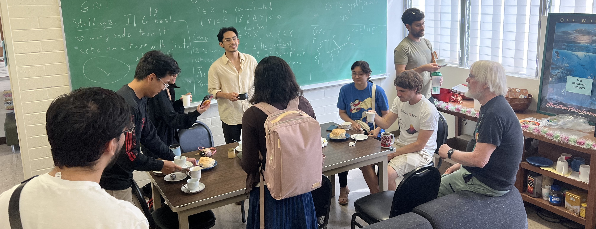

# Welcome to HCREAM
<figure markdown="span">
  { width="1200" }
</figure>
## Mission Statement

1.  Conduct cutting edge mathematical and scientific research inspired by real-world challenges faced by the Hawaii & Pacific Island (H&PI) community.
2.  Consult with institutions on issues pertinent to the H&PI community that have a quantitative or mathematical component.
*[institutions]: civil organizations, higher education institutions, state & local governments, etc.
3.  Research educational methods driven by innovative learning techniques.
4.  Conduct educational outreach within the H&PI to support STEM education and communication to motivate the study of mathematics.

## Vision Statement

1.  A mathematical community dedicated to doing open science & developing technologies that enable community autonomy.
2.  Institutions to listen to and value mathematical and scientific research.
3.  See an increase in perceived value of basic mathematical and scientific research.
4.  See a community where the mathematical sciences flourish and scientific, data-backed ideas form the basis of solutions to problems faced by the H&PI community​​​​​​.
5.  Availability of educational materials that go above & beyond the standard curriculum, making advanced topics accessible.
6.  A community where existing power structures are held accountable to the people that they serve by clearly communicating the scientific and mathematical basis of the decisions they make to the public.

## Calendar

<iframe src="https://calendar.google.com/calendar/embed?src=fd9447339a4507cd376ab53d32f61154d7e62cc4b13e4025e1f7fed60732a7ac%40group.calendar.google.com&ctz=Pacific%2FHonolulu" style="border: 0" width="800" height="600" frameborder="0" scrolling="no"></iframe>

## Funding

HCREAM currently has no funding. If you are interested in funding HCREAM, please contact <tongalan@hawaii.edu>. Additionally, we are planning to accept donations through _Venmo_.
